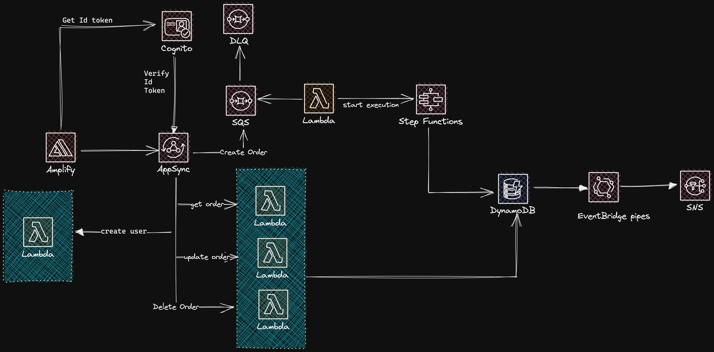

# Event Driven Architecture
## Building an ordering management system using the concept of Event Driven Architectures

### Solutions Architecture 



This project contains source code and supporting files for a serverless application that you can deploy with the SAM CLI. It includes [Lambda Powertools for operational best practices](https://github.com/awslabs/aws-lambda-powertools-python), and the following files and folders.

- **`hello_world`** - Code for the application's Lambda function.
- **`events`** - Invocation events that you can use to invoke the function.
- **`tests`** - Unit tests for the application code. 
- **`template.yaml`** - A template that defines the application's AWS resources.
- **`Makefile`** - Makefile for your convenience to install deps, build, invoke, and deploy your application.

If you prefer to use an integrated development environment (IDE) to build and test your application, you can use the AWS Toolkit.  

* [VS Code](https://docs.aws.amazon.com/toolkit-for-vscode/latest/userguide/welcome.html)
* [PyCharm](https://docs.aws.amazon.com/toolkit-for-jetbrains/latest/userguide/welcome.html)
* [IntelliJ](https://docs.aws.amazon.com/toolkit-for-jetbrains/latest/userguide/welcome.html)
* [Visual Studio](https://docs.aws.amazon.com/toolkit-for-visual-studio/latest/user-guide/welcome.html)

## Requirements

**Make sure you have the following installed before you proceed**

* AWS CLI - [Install AWS CLI](https://docs.aws.amazon.com/cli/latest/userguide/cli-chap-install.html) configured with Administrator permission
* SAM CLI - [Install the SAM CLI](https://docs.aws.amazon.com/serverless-application-model/latest/developerguide/serverless-sam-cli-install.html)
* [Python 3 installed](https://www.python.org/downloads/)
* Docker - [Install Docker community edition](https://hub.docker.com/search/?type=edition&offering=community)

## Deploy the sample application

> **Already know this sample? Run: `make hurry` - This command will install app deps, build, and deploy your Serverless application using SAM.**

Build and deploy your application for the first time by running the following commands in your shell:

```bash
event-driven-app$ make build
event-driven-app$ make deploy.guided
```

The first command will **build** the source of your application within a Docker container. The second command will **package and deploy** your application to AWS. Guided deploy means SAM CLI will ask you about the name of your deployment/stack, AWS Region, and whether you want to save your choices, so that you can use `make deploy` next time.

## Use the SAM CLI to build and test locally

Whenever you change your application code, you'll have to run build command:

```bash
event-driven-app$ make build
```

The SAM CLI installs dependencies defined in `hello_world/requirements.txt`, creates a deployment package, and saves it in the `.aws-sam/build` folder.

Test a single function by invoking it directly with a test event:

```bash
event-driven-app$ make invoke
```

> An event is a JSON document that represents the input that the function receives from the event source. Test events are included in the `events` folder in this project.

The SAM CLI can also emulate your application's API. Use the `make run` to run the API locally on port 3000.

```bash
event-driven-app$ make run
event-driven-app$ curl http://localhost:3000/hello
```

The SAM CLI reads the application template to determine the API's routes and the functions that they invoke. The `Events` property on each function's definition includes the route and method for each path.

```yaml
      Events:
        HelloWorld:
          Type: Api
          Properties:
            Path: /hello
            Method: get
```

## Fetch, tail, and filter Lambda function logs

To simplify troubleshooting, SAM CLI has a command called `sam logs`. `sam logs` lets you fetch logs generated by your deployed Lambda function from the command line. In addition to printing the logs on the terminal, this command has several nifty features to help you quickly find the bug.

`NOTE`: This command works for all AWS Lambda functions; not just the ones you deploy using SAM.

```bash
event-driven-app$ sam logs -n HelloWorldFunction --stack-name <Name-of-your-deployed-stack> --tail
```

You can find more information and examples about filtering Lambda function logs in the [SAM CLI Documentation](https://docs.aws.amazon.com/serverless-application-model/latest/developerguide/serverless-sam-cli-logging.html).

## Unit tests

Tests are defined in the `tests` folder in this project, and we use Pytest as the test runner for this sample project.

Make sure you install dev dependencies before you run tests with `make dev`:

```bash
event-driven-app$ make dev
event-driven-app$ make test
```

## Cleanup

To delete the sample application that you created, use the AWS CLI. Assuming you used your project name for the stack name, you can run the following:

```bash
event-driven-app$ aws cloudformation delete-stack --stack-name event-driven-app
```

# Appendix

## Powertools

**Tracing**

[Tracer utility](https://awslabs.github.io/aws-lambda-powertools-python/core/tracer/) patches known libraries, and trace the execution of this sample code including the response and exceptions as tracing metadata - You can visualize them in AWS X-Ray.

**Logger**

[Logger utility](https://awslabs.github.io/aws-lambda-powertools-python/core/logger/) creates an opinionated application Logger with structured logging as the output, dynamically samples 10% of your logs in DEBUG mode for concurrent invocations, log incoming events as your function is invoked, and injects key information from Lambda context object into your Logger - You can visualize them in Amazon CloudWatch Logs.

**Metrics**

[Metrics utility](https://awslabs.github.io/aws-lambda-powertools-python/core/metrics/) captures cold start metric of your Lambda invocation, and could add additional metrics to help you understand your application KPIs - You can visualize them in Amazon CloudWatch.

## Makefile

We included a `Makefile` for your convenience - You can find all commands you can use by running `make`. Under the hood, we're using SAM CLI commands to run these common tasks:

* **`make build`**: `sam build --use-container`
* **`make deploy.guided`**: `sam deploy --guided`
* **`make invoke`**: `sam local invoke HelloWorldFunction --event events/hello_world_event.json`
* **`make run`**: `sam local start-api`

## Sync project with function dependencies

Pipenv takes care of isolating dev dependencies and app dependencies. As SAM CLI requires a `requirements.txt` file, you'd need to generate one if new app dependencies have been added:

```bash
event-driven-app$ pipenv lock -r > event_driven_service/requirements.txt
```
